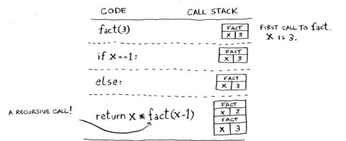

class: inverse, center, middle
background-image: url(figs/p_and_p_cover.png)
background-size: cover
.hide-logo[
# Monitoria IF968 - P1 - SI 2021.1

## Recursão
### pccn@cin.ufpe.br  |  (87)9 9995-2777  
## 29 de nov de 2021
]
---

```{r setup, include=FALSE}
options(htmltools.dir.version = FALSE)
knitr::opts_chunk$set(
  fig.width=9, fig.height=3.5, fig.retina=3,
  out.width = "100%",
  cache = FALSE,
  echo = TRUE,
  message = FALSE, 
  warning = FALSE,
  hiline = TRUE
)
```

```{r xaringan-themer, include=FALSE, warning=FALSE}
library(xaringanthemer)
library(xaringanExtra)
# style_duo_accent(
#   primary_color = "#1381B0",
#   secondary_color = "#FF961C",
#   inverse_header_color = "#FFFFFF",
#   title_slide_background_color = "#FF961C",
#   background_image = "Horizontal Monocromático Preto - Logotipo CIn-UFPE.png"
# )
style_mono_accent(background_image = "Horizontal Monocromático Preto - Logotipo CIn-UFPE.png")
```

```{r xaringanExtra-scribble, echo=FALSE}
xaringanExtra::use_scribble()
xaringanExtra::use_panelset()
xaringanExtra::use_progress_bar(color = "#43418a", location = "top", height = "10px")
xaringanExtra::use_extra_styles(
  hover_code_line = TRUE,
  mute_unhighlighted_code = TRUE
)
```


```{r xaringanExtra-clipboard, echo=FALSE}
htmltools::tagList(
  xaringanExtra::use_clipboard(
    button_text = "<i class=\"fa fa-clipboard\"></i>",
    success_text = "<i class=\"fa fa-check\" style=\"color: #90BE6D\"></i>",
  ),
  rmarkdown::html_dependency_font_awesome()
)
```

```{css, echo = FALSE}
# .remark-slide-content {
#   font-size: 28px;
#   padding: 20px 80px 20px 80px;
# }
.remark-code, .remark-inline-code {
  background: #f0f0f0;
}
.remark-code {
  font-size: 24px;
}
.huge .remark-code { /*Change made here*/
  font-size: 200% !important;
}
.tiny .remark-code { /*Change made here*/
  font-size: 80% !important;
}

```

# Recursão
Uma **função** é **recursiva** quando pode chamar a si mesma. 
--
E qual o motivo pra fazer isso?
--

Quebrar problemas maiores em problemas menores, e cada vez menores, até que se chegue num problema _simples_ o suficiente pra ser resolvido de forma fácil.

--
#### Exemplo de um problema simples. A soma dos elementos de uma lista:
.panelset[
.panel[.panel-name[Sem recursão]
```{python, collapse = TRUE}
def soma_lista(lista):
    soma = 0
    for i in lista:
        soma = soma + i
    return soma

print(soma_lista([1,3,5,7,9]))
```
]
.panel[.panel-name[Com Recursão]
```{python, collapse = TRUE}
def soma_lista(lista):
    if len(lista) == 1: # caso base (o mais simples: uma lista de 1 elemento)
        return lista[0]
    else:
        return lista[0] + soma_lista(lista[1:]) # chamada da própria função

print(soma_lista([1,3,5,7,9]))
```
]
]

---

### Caso base e caso recursivo
Por possuir essa característica de "chamar a si mesma", uma função recursiva escrita com descuido, pode acabar entrando num **loop infinito**. Isso é bem comum.
--
.pull-left[
#### Exemplo ilustrativo
Vamos para um exemplo simples, de uma função que conta de 10 até 1 (como se fosse uma brincadeira de "pique-esconde" ou "se esconda"). (Ignore o fato de que 10s são muito pouco pra se esconder adequadamente).
O Cebolinha tem como referências o primeiro valor (o 10), que vai sendo decrementado, e o último (o 1, que antecede o famigerado "Lá vou eu!"). Sem essa referência (o caso base) ele contaria pra sempre, contando até passar do 1 (ou zero) e indefinitivamente até que a Mônica voltasse e arrebentasse com a cara do salafrário.
]
.pull-right[

]

---
### Caso base e caso recursivo
.panelset[
.panel[.panel-name[Contagem]
```{python, collapse = TRUE}
def contagem(i):
    print(f"{i:2}...")
    if i <= 1: # caso base
        print("Lá vou eu!")
    else: # caso recursivo, com o decremento necessário
        contagem(i-1)

```
]
.panel[.panel-name[Resultado]
```{python, collapse = TRUE}
contagem(10)
```
]
.panel[.panel-name[Sem caso base]
```{python, collapse = TRUE}
def contagem_2(i):
    print(i)
    contagem_2(i-1)
```
]
.panel[.panel-name[Resultado 2]
```{python, collapse = TRUE, error = TRUE}
contagem_2(10)
```
]
]
---
### Pilha de Recursão
Você pode ter percebido que ao invés de ter rodado sem parar, o exemplo sem o caso base retornou um **erro de recursão**:
```
## RecursionError: maximum recursion depth exceeded
```
Isso se deve à forma pela qual o Python lida com as chamadas de funções recursivas. Há um limite no tamanho da pilha que é formada com as chamadas e se ele for excedido a execução para com o erro. É uma forma de proteger a memória do computador. Em outras linguagens o tamanho da pilha pode variar e o modo como esse problema é tratado também, mas em geral uma pilha é montada com as chamadas das funções recursivas. O tamanho da pilha pode ser um empecilho também a depender 
do problema que se busca solucionar (assunto de Algoritmos e Estrutura de Dados) e uma solução _iterativa_ acaba sendo mais interessante.
--

#### Então, como entender essa tal pilha?
Podemos usar o cálculo do fatorial e um pouco de desenho.
---
### Pilha de Recursão
No primeiro código temos uma possibilidade de função recursiva para cálculo do fatorial. No segundo, temos uma alternativa que mostra como funcionaria a pilha de recursão.
.panelset[
.panel[.panel-name[Fatorial]
```{python, collapse = TRUE}
def fatorial(n):
    if n == 1:
        return 1
    else:
        return n * fatorial(n - 1)

print(fatorial(3))
```
]
.panel[.panel-name[Fatorial modificado]
.tiny[
```{python, collapse = TRUE}
def fatorial(n):
    print(f"Calculando o fatorial de {n}")
    if n == 1 or n == 0:
        print(f" fatorial de {n} = 1")
        return 1
    else:
        fat = n * fatorial(n - 1)
        print(f" fatorial de {n} = {fat}")
    return fat

print(fatorial(3))
```
]
]
]
---
### Pilha de Recursão desenho


---
### Pilha de Recursão desenho


---
### Pilha de Recursão desenho

---

---
```{r echo=FALSE, fig.align = 'left', out.width = "50%", fig.cap = "Figure caption", fig.subcap="Grokking"}

```
---
### Exemplos
.panelset[
.panel[.panel-name[Fibonacci]
```{python, collapse = TRUE}
def fibonacci_r(n):
    if n <= 1:
        return n
    else:
        return fibonacci_r(n - 1) + fibonacci_r(n - 2)

print(fibonacci_r(10))
```
]
.panel[.panel-name[Fibo com contador]
```{python, collapse = TRUE}
count = 0
def fibonacci_r1(n):
    global count
    count +=1
    if n <= 1:
        return n
    else:
        return fibonacci_r1(n - 1) + fibonacci_r1(n - 2)
        
print(fibonacci_r1(10), count)
```
]
.panel[.panel-name[Fibo mais robusto]
```{python, collapse = TRUE}
count = 0
def fibonacci_r2(n, t1 = 1, res = 0):
    global count    
    if n > 1:
        count +=1
        res = fibonacci_r2(n - 1, res, t1 + res)
    return res

print(fibonacci_r2(11), count)
```
]
.panel[.panel-name[Pilha estourando]
```{python, collapse = TRUE, error = TRUE}
print(fibonacci_r2(1000), count)
```
]
.panel[.panel-name[Fibo sem recursão]
```{python, collapse = TRUE}
def fibonacci_s(n):
    t1 = 0
    t2 = 1
    while n > 0:
        t1, t2 = t2, t2 + t1
        n -= 1
    return t1

print(fibonacci_s(10))
print(fibonacci_s(1000))
```
]
]


---
### As "3 leis da recursão"
A partir dos exemplos ilustrativos anteriores, podemos então definir 3 regras básicas (ou características) para que uma função seja de fato recursiva:

1. deve ter um **caso básico**

2. deve **mudar o seu estado** e se **aproximar do caso básico**.

3. deve **chamar a si mesmo**, recursivamente.

---
# Referências

4.2. O que é recursão? — Resolução de Problemas Usando Python. Disponível em: <https://panda.ime.usp.br/panda/static/pythonds_pt/04-Recursao/01-introducao.html>. Acesso em: 19 nov. 2021.

4.4. As Três Leis da Recursão — Resolução de Problemas Usando Python. Disponível em: <https://panda.ime.usp.br/panda/static/pythonds_pt/04-Recursao/03-tresLeis.html>. Acesso em: 19 nov. 2021.

4.6. Blocos de Pilha: Implementando Recursão — Resolução de Problemas Usando Python. Disponível em: <https://panda.ime.usp.br/panda/static/pythonds_pt/04-Recursao/05-pilhas.html>. Acesso em: 19 nov. 2021.

**Chapter 3. Recursion · Grokking Algorithms: An illustrated guide for programmers and other curious people**. Disponível em: <https://livebook.manning.com/book/grokking-algorithms/chapter-3/>. Acesso em: 19 nov. 2021. 

COMPUTERPHILE. **What on Earth is Recursion? - Computerphile**, 2014. Disponível em: <https://www.youtube.com/watch?v=Mv9NEXX1VHc>. Acesso em: 19 nov. 2021

[DOWNEY, A. B. **Pense em Python: Pense Como um Cientista da Computação.** Novatec Editora, 2016.](https://penseallen.github.io/PensePython2e/) 

[MENEZES, N. N. C. **Introdução à Programação com Python: Algoritmos e Lógica de Programação Para Iniciantes.** 3a edição ed. Novatec Editora, 2019.](https://python.nilo.pro.br/)


---
class: center, middle

# Obrigado!

Slides criados usando os seguintes pacotes do R:

[**xaringan**](https://github.com/yihui/xaringan)<br>
[gadenbuie/xaringanthemer](https://github.com/gadenbuie/xaringanthemer)

[remark.js](https://remarkjs.com), [**knitr**](http://yihui.name/knitr), e [R Markdown](https://rmarkdown.rstudio.com).
